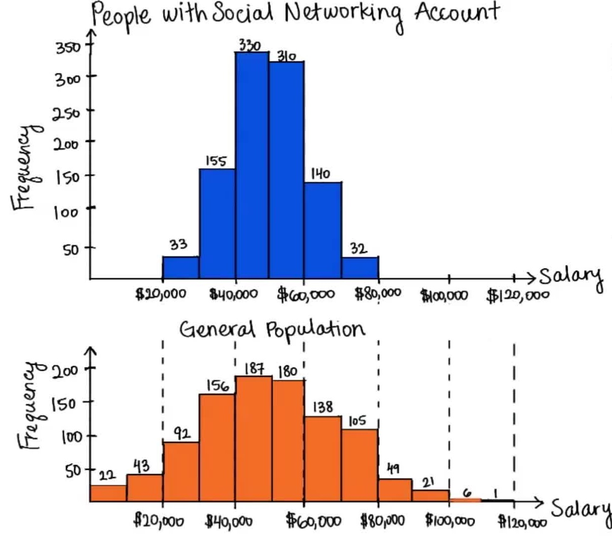
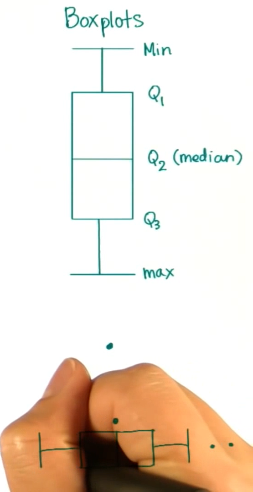
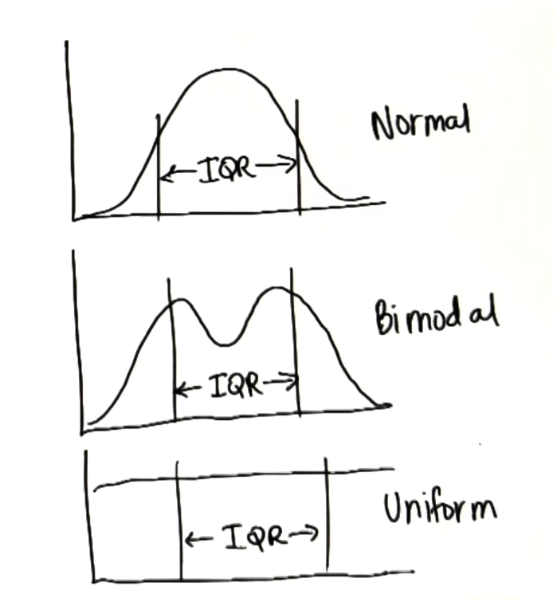

# Udacity Bertelsmann Data Science Challenge Scholarship Course Notes

## Statistics

### Intro To Statistical Research Methods

#### Constructs
Difficult to define and measure. It can be defined and measured in many different ways.

#### Operational Definitions
A way of turning constructs into variables we can measure.

- Volume is a construct. It is the space that takes up something but we have not define how we are measuring that space. (i.e. liters, gallons) Volume in liters is not a construct because it is operationally defined. Minutes is already operationally defined; there is no ambiguity in what we are measuring.

#### Population & Sample
Larger sample size is better with a good mix. In a random sample each subject has an equal chance of being selected, and it’s more likely to approximate the population.

- Population: all the individuals in a group
- Sample (n): some of the individuals in a group
- Parameter: a characteristic of the population
- Statistic: a characteristic of the sample
- μ: mean of a population
- x̄ bar: mean of a sample
- Sampling Error (μ - x̄): difference between the sample average & population average.

#### Observational Studies & Controlled Experiment

- In an experiment, the way the researchers handle subjects is called a treatment. Researchers are specifically interested in how different treatments might get different results. Researcher manipulates independent variable, measures changes in the dependent variable and controls lurking variables.
- An observational study is when an experimenter watches a group of subjects and does not introduce a treatment. A survey is an observational study.

#### Survey
Surveys are being use in social and behavioral science.

| Advantages | Disadvantages   |
|------|------|
|   Easy to get info on a population  | Untruthful responses|
|   Relatively inexpensive  | Biased responses|
|   Conducted remotely  | Respondents not understanding the qn|
|   Anyone can access & analyze survey results  | Respondents refuse to answer|

#### Correlation does not imply Causation.
- Show Relationships: Observational studies (i.e Survey)
- Show Causation: Controlled experiment
- A variable is a value that may change or differ between individuals in an experiment.
- Hypotheses are statements about the relationships between variables.
- Independent Variable (aka predictor variable) is the variable that experimenters choose to manipulate. It is usually plotted along the x-axis of a graph.
- Dependent Variable (aka outcome) is the variable that experimenters choose to measure during an experiment; it is usually plotted along the y-axis of a graph.  
- Extraneous factors (aka Lurking variables) are things that can impact the outcome of data analysis. It’s difficult to account for every extraneous factor. Can minimize the effect of certain variables on results of a experiment via random assignment.
- Treatment Group is the group of a study that receives varying levels of the independent variable. These groups are used to measure the effect of a treatment.
- Control Group is the group of a study that receives no treatment. This group is used as a baseline when comparing treatment groups.
- Placebo is something given to subjects in the control group so they think they are getting the treatment, when in reality they are getting something that causes no effect. (i.e. sugar pill)
- Blinding is a technique used to reduce bias. Double blinding ensures that both those administering treatments and those receiving treatments do not know who is receiving which treatment.

### Visualizing Data

- Always organize the data based on the questions you want to answer.

**Frequency Table:** is constructed by arranging collected data values with their corresponding frequencies.
**Frequency (f):** a particular data value is the number of times the data value occurs.
**Relative Frequency (aka Proportion p):** fraction of counts over total (frequency/total number). All proportions are always between or equal to 0 and 1. Sum is 1.
**Percentage(%):** Relative Frequency * 100. Percentage are always between or equal to 0 and 100. Sum is 100.
**Sum (Σ):** The total sum. The sign is the Greek letter capital sigma.
**Interval/bin/bucket**: Range of values

**Histogram:**
is a graphical representation of the distribution of data.

- Good for visualizing the shape of a distribution.
- x-axis has the variable you're interested in, broken down into bins.
- y-axis has the frequency of values in that bin.
- Intersection of the axes is origin. Its Cartesian coordinates are (0,0) if we go zero & up in both axes.
- Bigger bin size means frequency gets bigger (more values will fall inside the bin).

**Comparison between Historgram & Bar Graph**

| Histogram | Bar Graph|
|------|------|
| No space between each bar| Some space between each bar|
| Shape is very important| Shape is not important|
| Variable on x-axis is numerical & quantitative| Variable on x-axis is categorical or qualitative|
| Order matters, it goes from low to high along x-axis| Order doesn't matter|

### Skewed distribution

- Negative Skewed: shorter bins on the left and taller bins on the right.
- Positive Skewed: shorter bins on the right and taller bins on the left.
- Symmetric (Normal Distribution): can draw a line down the middle and the right side mirrors the left side.

### Central Tendency
- Measures of the center: Mean, Median & Mode.

Mean
Average is a statistic that rests at a specific spot in the middle of the distribution

Sample Mean = sum of the values divided by the number of values in the sample
x̄ = Σ x / n

Population Mean = sum of the values, divided by the number of values in the population
μ = Σ x / N

- Many samples from the same population will have similar means.
- The mean of a sample can be used to make inferences about the population it came from.
- The average can be misleading when we have outliers.
- Outliers: values that are unexpectedly different from the other observed values. Create skewed distributions by pulling the mean toward the outlier.

Median
The value in the middle of the distribution is called the median.
- It is not affected by extreme scores (outliers).
- Put the data in order (i.e least to greatest)
- Take the average of the two middle numbers when finding the median of data sets with an even number of scores.
- Best measurement of central tendency when dealing with highly skewed distributions.
- Formula for even: ((n/2)+(x/2)+1)/2
- Formula for odd: n+1/2

Mode
The value at which the frequency is highest is called the mode.
- The mode can be used to describe any type of data we have, whether its numerical or categorical.
- It is not affected by extreme scores (outliers).

Unifrom Distribution have no mode.

Bi-modal distribution have 2 mode.

Positive skewed distribution: mode < median < mean
Normally disributed: mode = median = mean

### Variability

The Blue histogram shows a more consistent distribution. Where the Orange histogram shows a sample that is more spread out.

**Quantify Spreadoutness**
Range provides a familiar picture of how spread out the data is.

Range: is the difference between the maximum value and the minimum value observed.
- Range sometimes changes when we add new data to the data set.
- Outliers increase the variability, but way too much when we use the range as our measure. Not accurate to use in the presence of outliers.

First Quartile
The first quartile is the point where 25% of the distribution is below that point, and 75% of the data is above that point.

Interquartile Range (aka IQR) = Q3 - Q1

- About 50% of the data falls within the IQR.
- The IQR is not affected by every value in the dataset, only affected by some of the values.
- The IQR is affected by outliers.

Outliers
A value is considered an outlier if:
- Value < Q1 - 1.5(IQR)
- Value > Q3 + 1.5(IQR)

- Cut off upper (25%) and lower (25%) tails of the distributions

#### Box Plots (aka Whisker Plots)
To visualize quartiles and outliers.

- Outliers are represented by dots.
- The median is always between Q1 and Q3.
- Mean will not always be between Q1 and Q3.

Different distribution can have the same IQR

Measure variability using all data values
- Find the average distance between each data value and the mean.

## Python
-

## SQL
-
